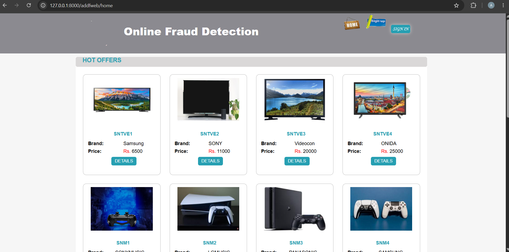
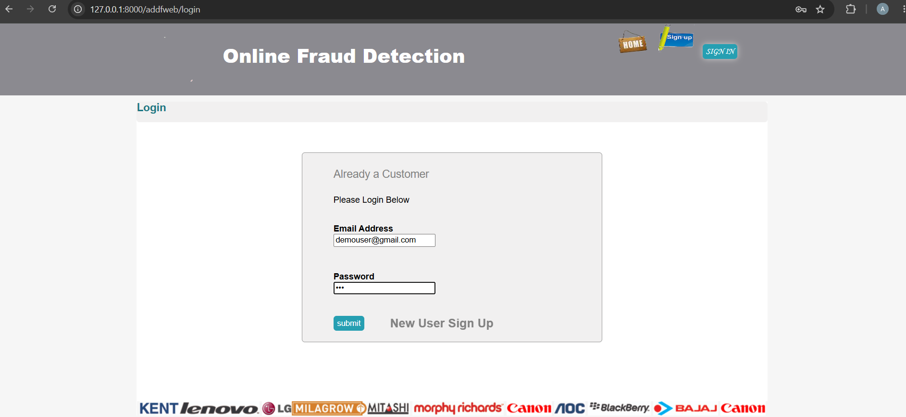
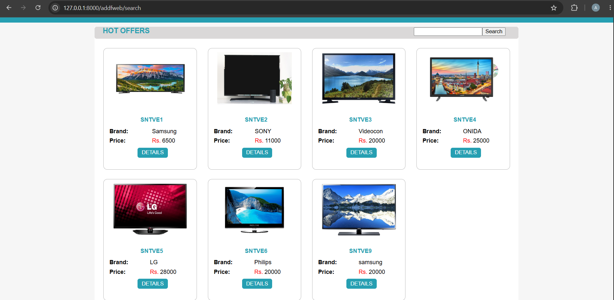
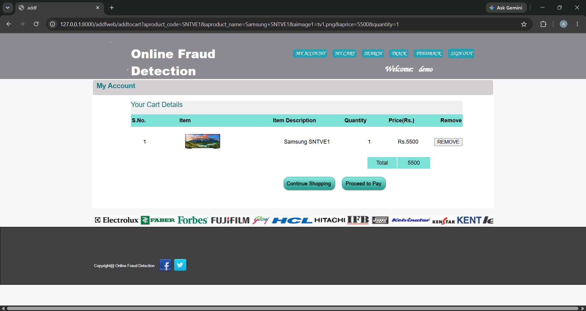
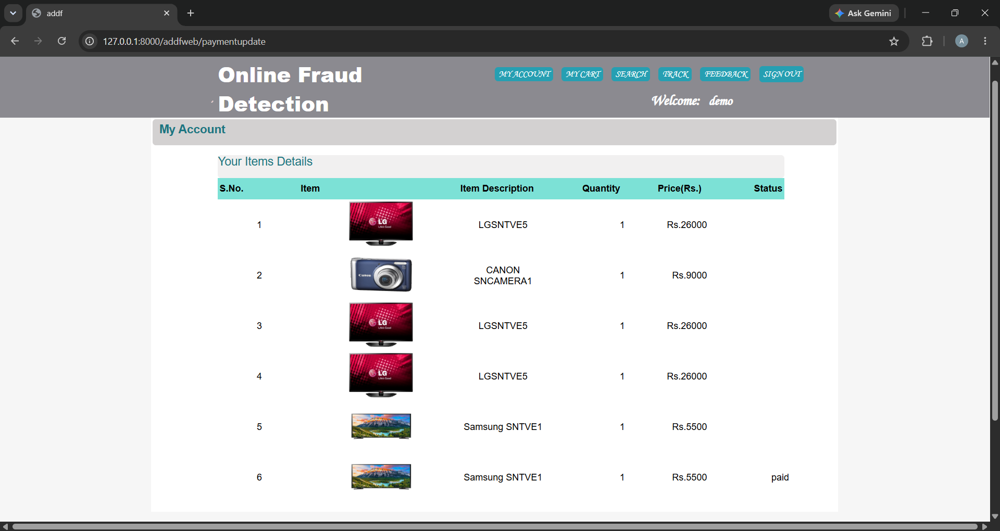
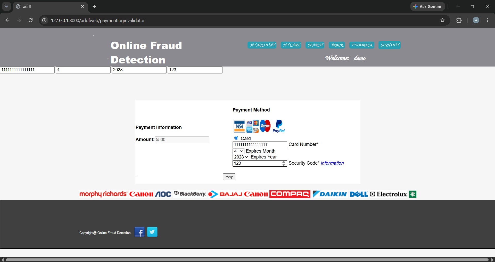

# Online Fraud Detection

A Django-based web application for handling online transactions and supporting fraud detection through customer, transaction, behavior, and location-related information.

The project combines an e-commerce-style transaction workflow with separate **User, Bank, and Admin** modules. It was developed as an academic/project application using Python, Django, MySQL, HTML, CSS, JavaScript, and XAMPP.

---

## 📌 About the Project

**Online Fraud Detection** is a web-based application developed using the Django framework.

The system is designed around online shopping and transaction processing while providing functionality related to fraud detection and transaction verification.

The project includes different modules for:

- Customers / Users
- Banks
- Administrators

Users can register and log in, browse and search products, manage a shopping cart, place transactions/orders, make payments, and provide feedback.

The bank-related functionality supports customer and transaction information that can be used for transaction verification and fraud-detection activities.

The project documentation describes **Behavior and Location Analysis (BLA)** as part of the fraud-detection approach. The purpose is to help distinguish suspicious transactions from genuine customer activity and reduce false positives.

---

## 🎯 Objectives

The main objectives of the project are:

- Provide a web-based online shopping and transaction system.
- Allow customers to register and manage their accounts.
- Allow users to browse and search available products.
- Provide shopping cart functionality.
- Support order and transaction processing.
- Provide payment-related functionality.
- Collect customer feedback.
- Provide bank-related functionality for transaction verification.
- Support fraud detection using available transaction, behavior, and location information.
- Help identify potentially suspicious transactions.
- Reduce false positives involving genuine customer transactions.

---

## ✨ Main Features

### 👤 User Module

The user/customer module provides functionality for:

- User registration
- User login
- User account management
- Profile editing
- Password changing
- Product browsing
- Product searching
- Shopping cart management
- Removing products from the cart
- Order / transaction tracking
- Payment-related operations
- Feedback submission

---

### 🏦 Bank Module

The bank module provides functionality related to:

- Bank registration
- Bank login
- Bank user management
- Customer information
- Payment / transaction information
- Transaction verification

The bank-side functionality forms part of the fraud-detection workflow.

---

### 👨‍💼 Admin Module

The administrator module provides functionality for managing and monitoring the application.

The project includes functionality for:

- Admin login
- Viewing customers
- Viewing payments
- Viewing feedback
- Adding products
- Updating products
- Deleting products
- Managing application information

---

### 🛒 Product and Shopping Features

The application includes an online shopping workflow where users can:

1. Browse products.
2. Search for products.
3. Add products to a shopping cart.
4. Remove products from the cart.
5. Proceed with the transaction/order process.

---

### 💳 Payment and Transaction Features

The project includes payment-related functionality for processing and viewing transaction information.

Transaction information is also used as part of the fraud-detection workflow.

---

### 🔍 Fraud Detection

The project focuses on identifying potentially suspicious online transactions.

The fraud-detection concept considers information such as:

- Customer information
- Transaction information
- Transaction value
- Customer behavior
- Transaction location

The project documentation describes **Behavior and Location Analysis (BLA)** as a method used to provide additional information to the Fraud Detection System (FDS).

---

## 🔄 System Workflow

The overall application workflow can be represented as:

```text
                    ┌──────────────────┐
                    │      User        │
                    └────────┬─────────┘
                             │
                             ▼
                    ┌──────────────────┐
                    │ Registration /   │
                    │      Login       │
                    └────────┬─────────┘
                             │
                             ▼
                    ┌──────────────────┐
                    │ Browse / Search  │
                    │    Products      │
                    └────────┬─────────┘
                             │
                             ▼
                    ┌──────────────────┐
                    │ Shopping Cart    │
                    └────────┬─────────┘
                             │
                             ▼
                    ┌──────────────────┐
                    │ Order / Payment  │
                    └────────┬─────────┘
                             │
                             ▼
                    ┌──────────────────┐
                    │ Transaction      │
                    │ Verification     │
                    └────────┬─────────┘
                             │
                             ▼
                    ┌──────────────────┐
                    │ Behavior &       │
                    │ Location Analysis│
                    └────────┬─────────┘
                             │
                             ▼
                    ┌──────────────────┐
                    │ Fraud Detection  │
                    │ / Verification   │
                    └──────────────────┘
```

---

## 🧩 Main Modules

The application can be divided into three main user-facing modules:

### 1. User

Responsible for customer activities such as registration, login, product browsing, cart management, transactions, payments, and feedback.

### 2. Bank

Responsible for bank-side activities related to customers, transactions, payments, and fraud-detection support.

### 3. Admin

Responsible for administrative activities such as viewing customer/payment/feedback information and managing products.

---

## 🛠️ Technology Stack

| Technology | Usage |
|---|---|
| **Python 3.8.10** | Backend programming language |
| **Django 2.2.7** | Web framework |
| **MySQL** | Application database |
| **mysql-connector-python** | MySQL connection from Python code |
| **HTML** | Web page structure |
| **CSS** | Styling |
| **JavaScript** | Client-side functionality |
| **XAMPP** | Local MySQL/server environment |
| **Visual Studio Code** | Development environment |
| **Git** | Version control |
| **GitHub** | Source code hosting |

---

## 📂 Project Structure

The repository contains the project source code, database file, and project documentation.

```text
AdithD - OnlineFraud Detection/
│
├── db/
│   └── onlinefddb.sql
│
├── docs/
│   ├── Introduction.docx
│   ├── ModuleDescription.docx
│   ├── ERDiagram.docx
│   ├── OnlineFraudDetection_DFD.docx
│   ├── SYSTEM IMPLEMENTATION_PYTHON.docx
│   ├── SYSTEM TESTING_PYTHON.docx
│   └── ...
│
└── project/
    └── OnlineFraudDetection/
        │
        ├── addf/
        │   ├── __init__.py
        │   ├── settings.py
        │   ├── urls.py
        │   ├── wsgi.py
        │   └── ...
        │
        ├── addfweb/
        │   ├── migrations/
        │   ├── static/
        │   ├── templates/
        │   ├── models.py
        │   ├── views.py
        │   ├── urls.py
        │   └── ...
        │
        ├── manage.py
        └── .gitignore
```

### Important Directories and Files

#### `project/OnlineFraudDetection/`

This is the main Django project directory containing the application source code.

#### `addf/`

This is the main Django project package.

It contains project-level configuration such as:

- Django settings
- Main URL configuration
- WSGI configuration

#### `addfweb/`

This is the main Django application package.

It contains:

- Views
- Models
- URLs
- Templates
- Static files
- Migrations
- Application functionality

#### `db/onlinefddb.sql`

This SQL file contains the database information required for setting up the project's MySQL database.

#### `docs/`

This directory contains project documentation, including documentation related to:

- Introduction
- Modules
- ER diagram
- Data Flow Diagram (DFD)
- System implementation
- System testing

---

# 💻 Installation and Setup

## Prerequisites

Install or have access to:

- Python 3.8.10
- XAMPP
- MySQL
- Git
- Visual Studio Code or another code editor
- A web browser

This project uses **Django 2.2.7**.

---

## 1. Clone the Repository

Clone the GitHub repository:

```bash
git clone https://github.com/adhithdadhi-18/OnlineFraudDetection.git
```

Move into the repository:

```bash
cd OnlineFraudDetection
```

The Django application is located inside:

```text
project/OnlineFraudDetection/
```

Move into the Django project directory:

```bash
cd project/OnlineFraudDetection
```

---

## 2. Create a Virtual Environment

Create a Python virtual environment:

```bash
python -m venv venv
```

The virtual environment keeps this project's Python packages separate from other Python projects.

---

## 3. Activate the Virtual Environment

On Windows Command Prompt:

```cmd
venv\Scripts\activate.bat
```

After activation, the terminal should show:

```text
(venv)
```

---

## 4. Install Django

Install the Django version used by the project:

```bash
pip install Django==2.2.7
```

---

## 5. Install MySQL Connector

Install the MySQL connector used by the application:

```bash
pip install mysql-connector-python
```

---

# 🗄️ Database Setup

The application contains MySQL database connection code and includes an SQL database file.

The database file is:

```text
db/onlinefddb.sql
```

## 1. Start XAMPP

Open the XAMPP Control Panel.

Start the **MySQL** service.

---

## 2. Open phpMyAdmin

Open phpMyAdmin through XAMPP.

Create a database named:

```text
onlinefddb
```

---

## 3. Import the SQL File

In phpMyAdmin:

1. Select the `onlinefddb` database.
2. Open the **Import** section.
3. Select:

```text
db/onlinefddb.sql
```

4. Start the import.

This creates the database structure and sample/test information used by the project.

---

## 4. Database Connection

The application code connects to MySQL using:

```text
Host: localhost
User: root
Database: onlinefddb
```

The project uses `mysql-connector-python` for these application-level MySQL connections.

---

# ▶️ Running the Project

After completing the database setup, open Command Prompt in:

```text
project/OnlineFraudDetection/
```

Activate the virtual environment:

```cmd
venv\Scripts\activate.bat
```

Run the Django development server:

```cmd
python manage.py runserver
```

The development server will normally be available at:

```text
http://127.0.0.1:8000/
```

Open that address in your browser.

---

# 📸 Screenshots

Screenshots can be added here to demonstrate the main parts of the application.

Suggested screenshots include:

### Home Page

```markdown

```

### User Registration / Login

```markdown

```

### Product Page

```markdown

```

### Shopping Cart

```markdown

```

### Payment / Transaction

```markdown

```

### Admin Dashboard

```markdown

```

### Fraud Detection / Transaction Verification

```markdown

```

---

# 📚 Project Documentation

Additional documentation is available in the `docs/` directory.

The documentation includes materials covering:

- Project introduction
- Module descriptions
- Entity Relationship Diagram (ER Diagram)
- Data Flow Diagram (DFD)
- System implementation
- System testing

These documents provide additional information about the design and implementation of the project.

---

# 🧪 Testing

The project repository contains a system testing document inside the `docs/` directory.

Testing documentation can be found under:

```text
docs/
```

The testing documentation provides additional information about the testing performed for the application.

---

# 🔐 Security and Fraud Detection Concept

The project is focused on online transaction security and fraud detection.

The fraud-detection concept considers transaction-related information together with customer behavior and location information.

The project documentation refers to **Behavior and Location Analysis (BLA)** and a **Fraud Detection System (FDS)** as components of the fraud-detection approach.

The purpose is to support the identification of suspicious transactions while helping reduce false positives involving genuine customer activity.

---

# 🚀 Possible Future Improvements

The project can be further improved by adding features such as:

- More advanced fraud-detection techniques
- Improved transaction monitoring
- Real-time fraud alerts
- Stronger authentication
- Improved password security
- More detailed fraud reports
- Better visualization of transaction information
- Improved user interface
- Additional transaction-risk analysis

These are possible future improvements and are not claimed as existing features of the current implementation.

---

# 👨‍💻 Author

**Adhith D**

### GitHub

https://github.com/adhithdadhi-18

### LinkedIn

https://www.linkedin.com/in/adhith-d-395804408

---

# 📄 Project Purpose

This project was developed as an academic software project to demonstrate the design and implementation of a web-based online transaction system with fraud-detection functionality.

It combines:

```text
Online Shopping
      +
Transaction Processing
      +
Bank-side Information
      +
Behavior & Location Analysis
      +
Fraud Detection
```

The project demonstrates the use of Django, Python, MySQL, HTML, CSS, and JavaScript to develop a multi-module web application.
